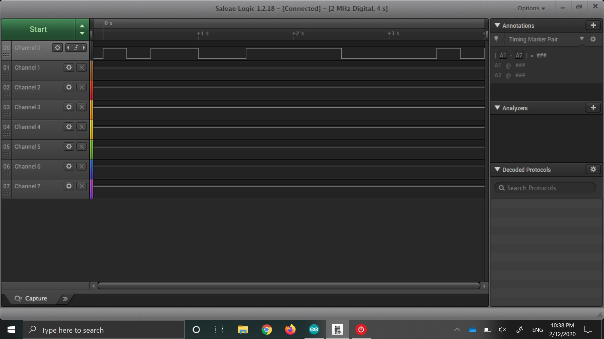
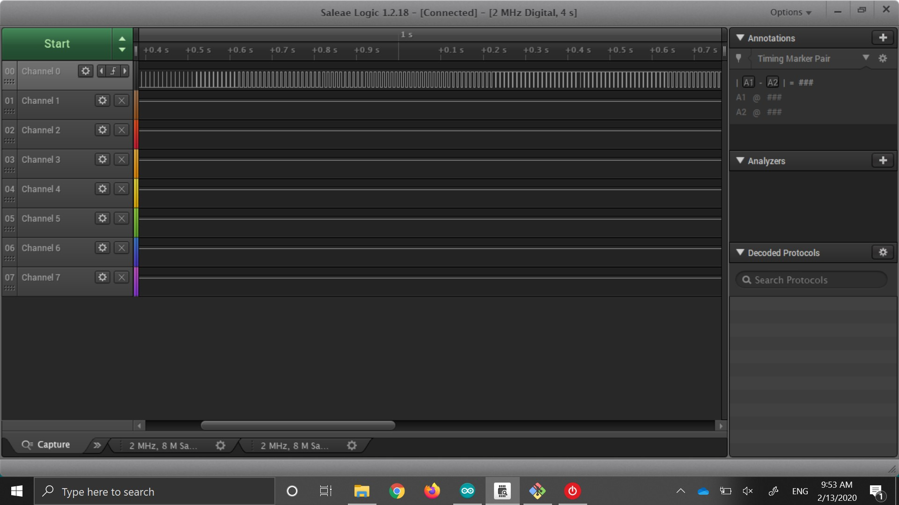
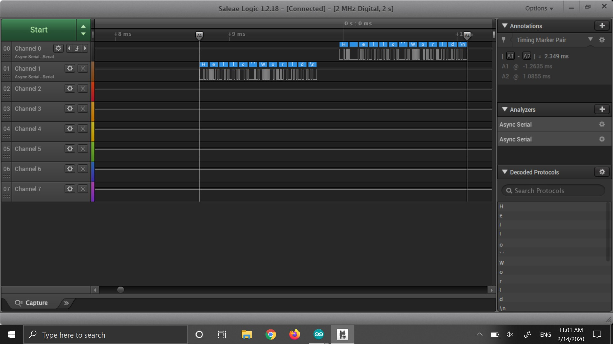

Name: Miguel Martinez

EID: mam25292

Team Number: F7

## Questions

1. Why does your program need a setup and a loop?

    Setup is for initializing the board. Set I/O and turn on the clock for the required ports.
    Loop is for code that will be continuouly running while the board is on running down the list
    effectively checking for updates.

2. What is the downside to putting all your code in a loop?

    If something changes that will affect something at the beginning of your loop, you'll have to wait
    for the loop to come back around to it before it can do anything about it.

3. Why does your code need to be compiled?

    C is the human readable version of the instructions that need to be carried out. After compiling, that is turned into commands that a processor can understand.

4. When lowering the frequency in procedure A, step 4, what is going wrong? Brainstorm some solutions. Dimmers exist in the real world. What is their solution?

    When the frequency is low you can see the part of the duty cycle that is off. That will cause the effect of flickering.In the real world, rather than changing the duty cyclem the voltage supplied to the LED is varied and causes the dimming effect.

5. Why do you need to connect the logic analyzer ground to the ESP32 ground?

    There needs to be a commmon ground to keep the one voltage from floating away from the other.
    Also there is no complete circuit without a common ground and therefore no current would flow making it difficult to pick up a signal.

6. What is the difference between synchronous and asynchronous communication?

    Synchronous; there is a time order. Requires a clock signal
    Asynchronous; no time order. Cannot predict the order.

7. Profile of UART: Sent X bytes in Y time 

    sent 11 characters in 2.349ms

8. Profile of SPI: Sent X bytes in Y time

    sent 11 characters in .3255ms

9. Why is SPI so much faster than UART?

    The Enable pin lets the board know when to start listening
    Each direction of communication has it's own line

10. list one pro and one con of UART

    Pro: Less pins and it is always listening for a transmission
    Con: It is a one way communication from master to slave; slow communication

11. list one pro and one con of SPI

    Pro: Two way communication from master to slave; faster communication
    Con: More pins

12. list one pro and one con of I2C

    Pro: Multiple slave devices can be connected with a master using onlu 2 pins
    Con: Very sensitive to noise, need to be short and well shielded

13. Why does I2C need external resistors to work?

    Because the pins need to be pulled up or down and the ESP32 cannot always do so.

## Screenshots

Procedure A, step 1:

Procedure A, step 4:

Procedure B, UART:

Procedure B, SPI:

